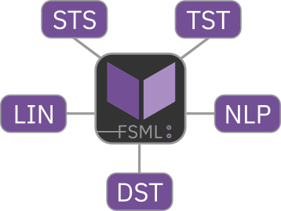

# Summary

`FSML` is a modern Fortran statistics and machine learning library suitable for contemporary research problems and teaching. It includes procedures for basic statistics, hypothesis tests, linear and non-linear methods, and statistical distribution functions.

# Statement of Need

The advances in computing technology over the past two decades have expanded the practical scope of statistics and allowed the widespread use of machine learning (ML). This also transformed research practices and enhanced predictive modelling across many disciplines, including Earth sciences [@tomasetti:2009; @boateng:2023], operational weather forecasting [@lang:2024], and more.

Fortran is a well-established general purpose programming language that is commonly adopted in science due to its stability, reliability, performance, and array functionality. It is widely used for parallelised high-performance computing and numerical modelling [e.g., @giorgetta:2018]. The same strenghts make it suitable for computationally demanding ML procedures and data-driven predictions. Furthermore, it is more energy-efficient than other high-level programming languages [@pereira:2021], which is another factor to consider as the widespread adoption of computationally demanding ML techniques also increases electricity consumption [@jia:2024], adds more stress on Earth’s climate and environments, and creates new challenges [e.g., @dodge:2022; @freitag:2021]. Despite Fortran’s long history in data-driven prediction and ML [e.g., @breiman:2001; @tomasetti:2009; @gutmann:2022], it has not been as widely adopted in these fields as other languages and lacks ,well documented, accessible toolkits for statistics and classic ML. While projects like Neural-Fortran[@curcic:2019], ATHENA[@taylor:2024], and [FStats](https://github.com/jchristopherson/fstats) cover some important procedures for deep-learning and classic statistics, the Fortran ecosystem in this discipline remains relatively small. This potentially deters from the use of Fortran, which is already perceived as less accessible than other popular languages due to 1) the lack of familiarity with modern Fortran features, which is exacerbated by stagnating adoption of Fortran at universities, and 2) shortcomings that are currently being addressed by Fortran-lang community [@kedward:2022].


`FSML` (Fortran Statistics and Machine Learning) purposefully integrates Fortran-lang community efforts [@kedward:2022]: It only relies on [stdlib](https://github.com/fortran-lang/stdlib)’s interfaces for linear algebra, uses [fpm](https://github.com/fortran-lang/fpm) for easier building and distribution, and is developed to support compilation with the community-maintained [LFortran](https://github.com/lfortran/lfortran) in addition to GFortran. As such, it builds on recent community efforts and addresses two gaps:

1. It adds to the modern Fortran statistics and ML software ecosytem. A richer ecosystem makes Fortran a more attractive choice as a robust, high-performance, energy-efficient option for these applications.

2. The use of fpm, the support of free open-source compilers, the extensive user-facing documentation (fsml.mutz.science), and its permissive license (MIT) faciliate its early adoption and integration into various statistics and ML projects by (university) students, early career researchers, and teachers. It can thus help counter the stagnating adoption of Fortran and prevent language monoculture.


# Software Description

## Scope

FSML consists of a set of accessible and well-documented statistics and ML procedures suitable for many contemporary research problems and teaching. These procedures are categorised into five thematic modules:

- DST: Statistical distributions (e.g., Student's t, generalised Pareto); probability density function, cumulative distribution function, and percent point function
- STS: Basic statistics for describing and understanding data (e.g., mean, variance, correlation)
- TST: Parametric and non-parametric hypothesis tests (e.g., Mann–Whitney U , analysis of variance)
- LIN: Statistical procedures relying heavily on linear algebra (e.g., principal component analysis, ridge regression, linear discriminant analysis)
- NLP: Non-linear and algorithmic procedures (e.g., k-means clustering)

{ width=50% }

FSML's requirements are minimal. It uses Fortran 2008 intrinsics, Fortran-lang stdlib for linear algebra, and fpm for easy and quick building and distribution. This faciliates easier adoption and encourages transition to a community-driven modern Fortran ecosystem.

## Documentation

The FSML handbook is hosted on [fsml.mutz.science](http://fsml.mutz.science/) and can also be re-generated from its source files. It includes detailed, example-rich documentation of covered procedures, as well as installation instructions and information for contributors.

# Examples

Demonstration for statistical distribution functions (DST module):

```fortran
  ! exponential distribution PDF with x=0.8 and lambda=0.5
  fx = fsml_exp_pdf(0.8_wp, lambda=0.5_wp)
  ! genrealised Pareto CDF with specified parameters
  fx = fsml_gpd_cdf(1.9_wp, xi=1.2_wp, mu=0.6_wp, sigma=2.2_wp, tail="left")
```

Demonstration for sample statistics and dependency measures  (STS module):

```fortran
  ! mean of vector x
  mean = fsml_mean(x)
  ! sample standard deviation of vector x
  std = fsml_std(x, ddf=1.0_wp)
  ! Pearson correlation coefficient for x1 and x2
  pcc = fsml_pcc(x1, x2)
  ! Spearman rank correlation coefficient for x1 and x2
  scc = fsml_scc(x1, x2)
```

Demonstration for hypothesis tests  (TST module):

```fortran
  ! two-sample t-test for unequal variances (Welch t-test);
  ! returns test statistic (t), degrees of freedom, and p-value
  call fsml_ttest_2sample(x1, x2, t, df, p, eq_var=.false., h1="two")
  ! one-way ANOVA on a rank-2 array (x2d);
  ! returns f-statistic, degrees of freedom and p-value
  call fsml_anova_1way(x2d, f, df1, df2, p)
```

Demonstration for multiple linear ridge regression (LIN module):
```fortran
  ! ridge regression for 100 data points, 5 variables, and lambda=0.2;
  ! returns y intercept (b0), regression coefficients (b), and R^2 (rsq)
  call fsml_ridge(x, y, 100, 5, 0.2_wp, b0, b, rsq)
```

# Past and Ongoing FSML Projects

The FSML procedures for clustering and linear discriminant analysis were reworked from the code used for climate pattern detection and explanation [@mutz:2018; @mutz:2019]. FSML's empirical orthogonal functions and analysis of variance were used in [@mutz:2025]. FSML's distribution functions are currently used for modelling climate extremes.

# Future Development

The priorities for future development are 1) an increase in scope (e.g., more regressors and distance measures), 2) the addition of helper procedures (reading, data transformation), 3) performance optimisations, and 4) the creation of more accessible tutorials.

# Acknowledgements

I gratefully acknowledge the Fortran-lang community efforts that this project integrates (fpm, stdlib, and LFortran), as well as the always helpful discussions the with the same community on Fortran-lang discourse and GitHub. I also extend my gratitude to Herbert Peck.

# References
